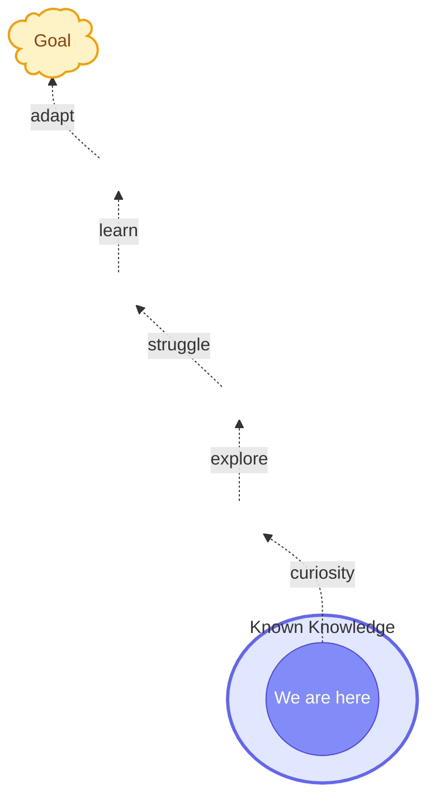
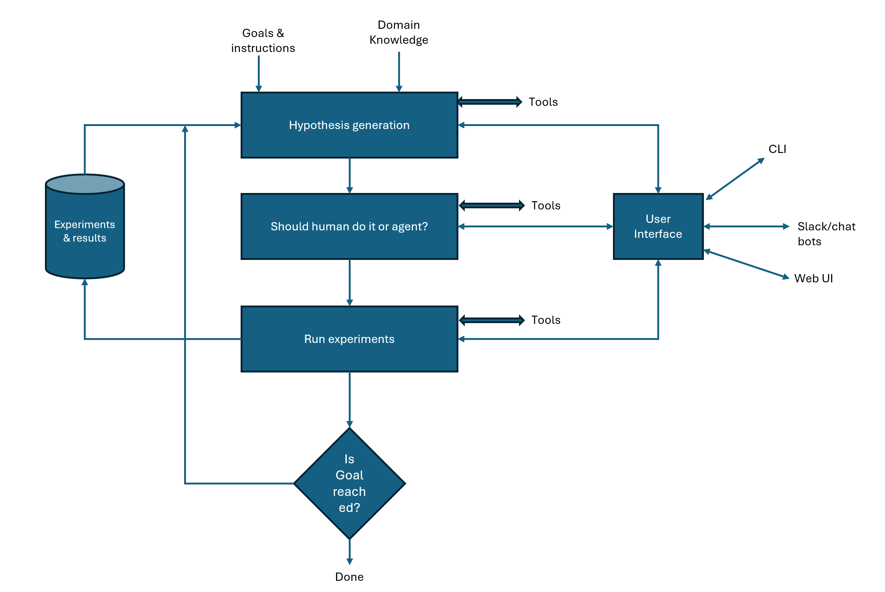

# Research and discovery
## Known Knowledge to Goal

Research discovery is a process of using existing knowledge and go beyond known human knowledge boundary and finding path to our goal. 



## Agent control loop



### Goal 
I am using algoroithmic trading as example to demonstrate this agentic reseach engine. 
```
- Look at Crude oil and natural gas futures data, we are interested in events where price increased or dropped by 1 %, predict these large moves.
```

```
Domain instructions:
- Use price volume information to find patterns before big moves. 
- Anything >70% prediction accuracy is considered valid goal. 
- Make sure to calculate the prediction accuracy in out of sample test set. 
- Use different granularity data, hourly, minute, etc. 
- Use digital signal processing techniquies to avoid noice and finding signal.
```

### High level overview
There are four important parts in this Agentic research loop.

1. **Hypothesis generator** — Based on the configured goal and past experiment results, generates a novel hypothesis to move toward the goal.
2. **Experiment agent** — Translates the hypothesis into a QuantConnect Python backtest, handles compile errors, runs the backtest, and stores results.
3. **Goal evaluator** — Checks whether the experiment reached the accuracy threshold (>70%). Stops the loop if achieved.
4. **Control loop** — Orchestrates the cycle, persists state so interrupted runs can be resumed.

---

## Setup

### Prerequisites

- Python 3.11+
- A [QuantConnect](https://www.quantconnect.com) account (free tier works)
- An Anthropic API key **or** Claude Code CLI login (`claude login`)

### 1. Clone and create a virtual environment

```bash
git clone https://github.com/sarath-hotspot/AgenticTrading
cd AgenticTrading
python -m venv .venv

# Windows
.venv\Scripts\activate

# macOS / Linux
source .venv/bin/activate
```

### 2. Install dependencies

```bash
pip install -e .
```

### 3. Configure credentials

Copy the example env file and fill in your credentials:

```bash
cp .env.example .env
```

Edit `.env`:

```
QC_USER_ID=<your QuantConnect user ID>
QC_API_TOKEN=<your QuantConnect API token>

# Optional — only needed if you are not using Claude Code SSO login
ANTHROPIC_API_KEY=<your Anthropic API key>

# Optional — enables web search in the hypothesis agent
SERPER_API_KEY=<your Serper.dev API key>
```

**QuantConnect credentials** — find them at
[quantconnect.com/account](https://www.quantconnect.com/account) under *My Account > API*.

**Anthropic API key** — if you are running inside Claude Code (`claude` CLI), the engine
automatically uses your SSO session and no explicit key is needed.

### 4. Edit the goal and domain knowledge (optional)

The three files in `config/` control what the engine researches:

| File | Purpose |
|------|---------|
| `config/goal.md` | The trading objective and success criterion |
| `config/instructions.md` | Domain constraints and methodology rules |
| `config/domain_knowledge.md` | Background knowledge, code snippets, and hints |

---

## Running the engine

### Start a research loop

```bash
engine run
```

Options:

| Flag | Default | Description |
|------|---------|-------------|
| `--max-iterations N` | 10 | Maximum hypothesis/experiment cycles before stopping |
| `--auto` | off | Skip the human approval prompt between iterations |
| `--resume` | off | Resume the last interrupted run from its checkpoint |

Examples:

```bash
# Run up to 5 iterations, ask for approval before each experiment
engine run --max-iterations 5

# Fully autonomous — no prompts, run until goal is reached or 10 iterations
engine run --auto

# Resume a run that was interrupted (Ctrl+C or crash)
engine run --resume
```

### Check experiment results

```bash
# Summary table of all experiments
engine status

# List all experiments with accuracy
engine results

# Full JSON record for one experiment
engine results exp_20260424_054936_3cd638
```

### Logs

Each run writes a timestamped log file to `logs/engine_<run_id>.log`. The log captures
every tool call, API response summary, iteration result, and any errors — useful for
debugging a run after the fact.

---

## Output files

| Path | Contents |
|------|---------|
| `experiments/index.json` | Index of all experiments (id, timestamp, accuracy, goal reached) |
| `experiments/exp_<id>.json` | Full record: hypothesis, algorithm code, QC project/backtest IDs, results |
| `logs/engine_<run_id>.log` | Timestamped log of the full run |
| `.engine_run_state.json` | Checkpoint file used by `--resume` (auto-deleted when run completes) |

---

## Project layout

```
AgenticTrading/
├── config/
│   ├── goal.md               # Trading objective
│   ├── instructions.md       # Domain constraints
│   └── domain_knowledge.md   # Background knowledge
├── engine/
│   ├── agents/
│   │   ├── hypothesis_agent.py   # Generates hypotheses via Claude
│   │   └── experiment_agent.py   # Writes and runs QC backtests via Claude
│   ├── tools/
│   │   ├── quantconnect.py   # QuantConnect API client
│   │   ├── storage.py        # Experiment persistence
│   │   └── websearch.py      # Optional web search (Serper)
│   ├── config_loader.py      # Reads config/ files
│   ├── loop.py               # Control loop with checkpointing
│   ├── run_logger.py         # File logging setup
│   ├── run_state.py          # Resume-state persistence
│   └── cli.py                # CLI entry point
├── experiments/              # Generated experiment records (git-ignored)
├── logs/                     # Run log files (git-ignored)
└── .env                      # Credentials (git-ignored)
```